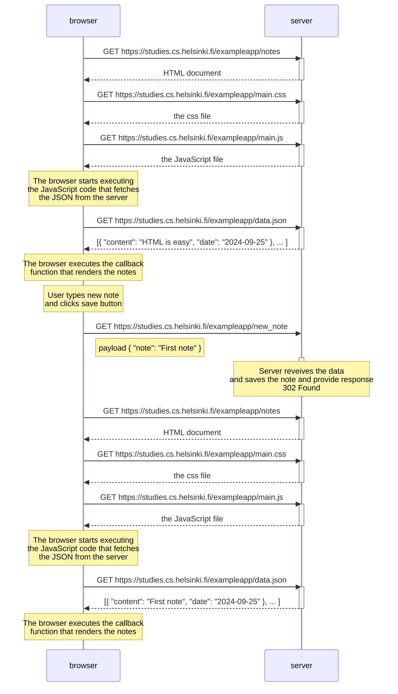

```mermaid
   sequenceDiagram
    participant browser
    participant server

    browser->>server: GET https://studies.cs.helsinki.fi/exampleapp/notes
    activate server
    server-->>browser: HTML document
    deactivate server

    browser->>server: GET https://studies.cs.helsinki.fi/exampleapp/main.css
    activate server
    server-->>browser: the css file
    deactivate server

    browser->>server: GET https://studies.cs.helsinki.fi/exampleapp/main.js
    activate server
    server-->>browser: the JavaScript file
    deactivate server

    Note over browser: The browser starts executing<br/> the JavaScript code that fetches<br/> the JSON from the server

    browser->>server: GET https://studies.cs.helsinki.fi/exampleapp/data.json
    activate server
    server-->>browser: [{ "content": "HTML is easy", "date": "2024-09-25" }, ... ]
    deactivate server

    Note over browser: The browser executes the callback<br/> function that renders the notes
    Note over browser: User types new note <br/> and clicks save button

    browser->>server: GET https://studies.cs.helsinki.fi/exampleapp/new_note
    Note right of browser: payload { "note": "First note" }
    activate server
    Note over server: Server reveives the data <br/> and saves the note and provide response <br/> 302 Found
    deactivate server

     browser->>server: GET https://studies.cs.helsinki.fi/exampleapp/notes
    activate server
    server-->>browser: HTML document
    deactivate server

    browser->>server: GET https://studies.cs.helsinki.fi/exampleapp/main.css
    activate server
    server-->>browser: the css file
    deactivate server

    browser->>server: GET https://studies.cs.helsinki.fi/exampleapp/main.js
    activate server
    server-->>browser: the JavaScript file
    deactivate server

    Note over browser: The browser starts executing<br/> the JavaScript code that fetches<br/> the JSON from the server

    browser->>server: GET https://studies.cs.helsinki.fi/exampleapp/data.json
    activate server
    server-->>browser: [{ "content": "First note", "date": "2024-09-25" }, ... ]
    deactivate server

    Note over browser: The browser executes the callback<br/> function that renders the notes
```
