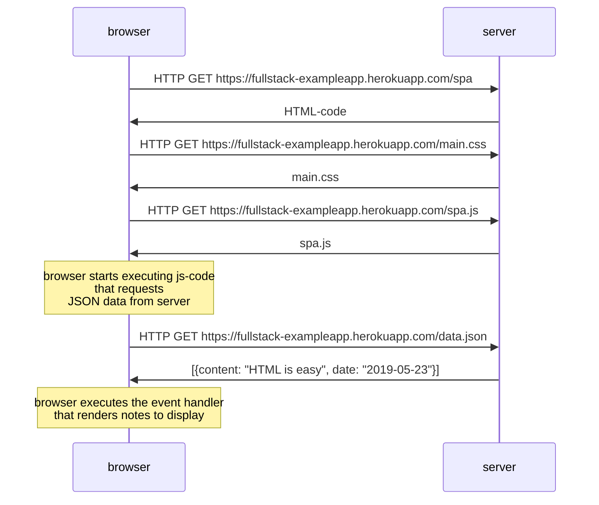

```mermaid
sequenceDiagram
    participant browser
    browser->>server: HTTP GET https://fullstack-exampleapp.herokuapp.com/spa
    server->>browser: HTML-code
    browser->>server: HTTP GET https://fullstack-exampleapp.herokuapp.com/main.css
    server->>browser: main.css
    browser->>server: HTTP GET https://fullstack-exampleapp.herokuapp.com/spa.js
    server->>browser: spa.js
    Note over browser: browser starts executing js-code <br/> that requests <br/>JSON data from server
    browser->>server: HTTP GET https://fullstack-exampleapp.herokuapp.com/data.json
    server->>browser: [{content: "HTML is easy", date: "2019-05-23"}]
    Note over browser: browser executes the event handler <br/> that renders notes to display
    participant server
```
